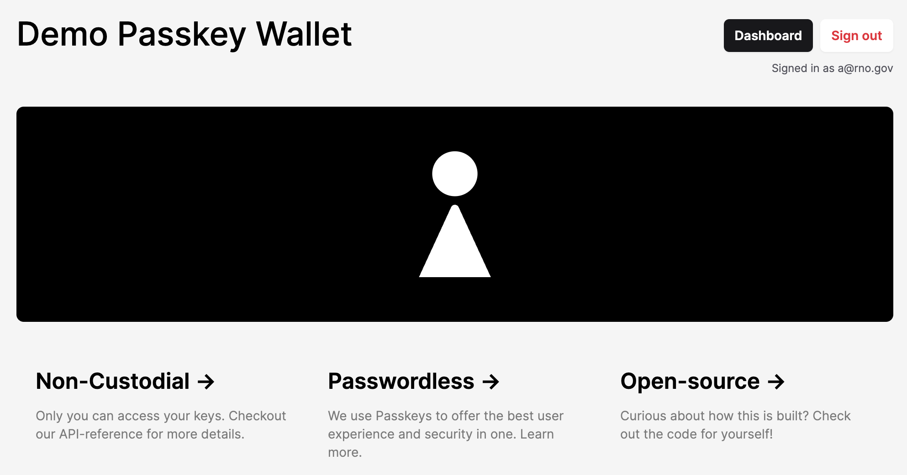
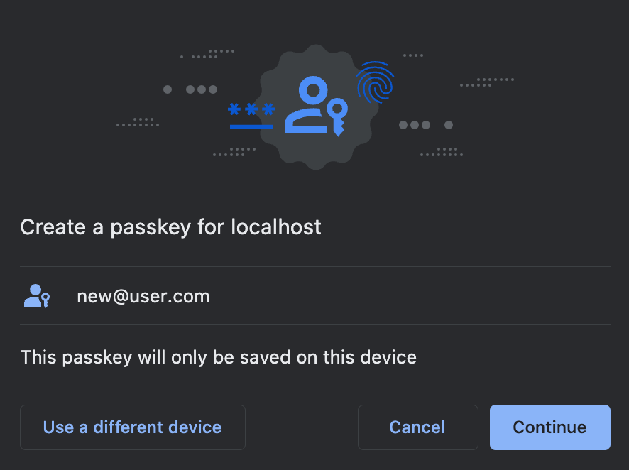
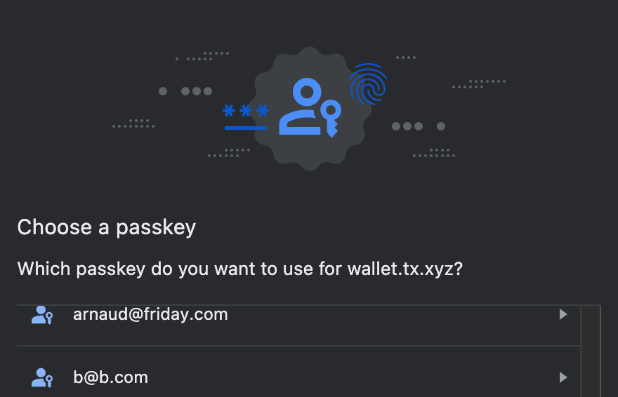
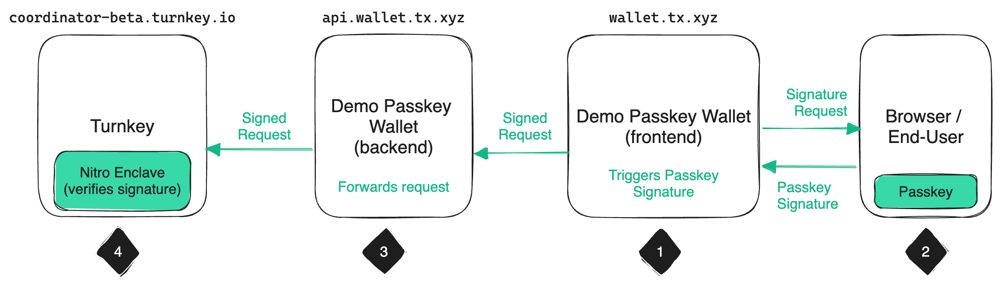

# Demo Passkey Wallet

> Note: this Demo Passkey Wallet has been deprecated in favor of Turnkey's [Demo Embedded Wallet](https://github.com/tkhq/demo-embedded-wallet)

This repo contains a wallet application **for demonstration purposes only** showing how users can be registered and authenticated with [passkeys](https://www.passkeys.io/). Passkey signatures are used for registration and authentication. The backend component forwards these signatures to [Turnkey](https://turnkey.io).

The Demo Passkey Wallet is currently hosted at [wallet.tx.xyz](https://wallet.tx.xyz). See [legal disclaimer](#legal-disclaimer).




## How it works

This application has two components:
* the frontend (in [`frontend`](./frontend/)) is a NextJS app running in browsers. Responsibilities are: serve the UI, make calls to the backend component, and execute passkey interactions (assertions or attestations). Passkey interactions are abstracted through [Turnkey JS SDK](https://github.com/tkhq/sdk). This is deployed through [Vercel](https://vercel.com/).
* the backend (main file: [`main.go`](./main.go)) is a Golang application handling requests made by the frontend. It uses the [Turnkey Golang SDK](https://github.com/tkhq/go-sdk) to interact with the Turnkey API. For deployment we use [Heroku](https://www.heroku.com/).

Requests and responses use JSON-over-HTTP. Now let's talk about the different flows implemented, one-by-one.

### Registration

The frontend uses a `whoami` endpoint to know whether a user has a current valid session. If not, the user needs to authenticate with a passkey. Let's pretend our user has never registered before: no previous session, no registered passkey!

When authentication happens, the email address entered in the authentication form is used to lookup users on the backend. Because the user is not found, the frontend performs a Webauthn registration ceremony with [Turnkey SDK](https://github.com/tkhq/sdk)'s `getWebAuthnAttestation` method: 



The collected credentials are used as parameters to the Turnkey API to create a new [Turnkey Sub-Organization](https://docs.turnkey.com/getting-started/sub-organizations). Each user registering their passkey has their own Turnkey Sub-Organization under the hood. The parent organization has **read-only access** to each sub-organization, but cannot modify their content or sign crypto transactions with any private keys held within Sub-Organizations.

### Signing In

Assuming a user is registered already, they will see a different prompt in their browser's native UI. Here's the authentication prompt in Chrome:



Once again, the frontend doesn't have to know anything about webauthn: it uses the Turnkey SDK method `getWebAuthnAssertion` to collect a signature from the user for a Turnkey "whoami" request for their sub-organization.

The backend then forwards this signed request to Turnkey. If the request is successful, then it means the user is indeed the owner of this sub-organization, and the backend grants a session as a result. The user is logged in!

### Faucet functionality

For convenience, this demo wallet has functionality to drop Sepolia ETH into wallet addresses. The faucet is itself a Turnkey organization, and the backend uses its API key to sign transfers from the faucet Turnkey organization to arbitrary addresses. Something to note: the faucet organization uses [Turnkey Policies](https://docs.turnkey.com/managing-policies/overview) to restrict what this Demo Wallet API key can do. The only thing it can do is sign transactions.

### Send functionality

For a signed-in user, the dashboard shows functionality to transfer Sepolia ETH to an arbitrary address. The amount and destination parameters are POSTed to the backend, the backend constructs an unsigned payload, and the frontend uses this to construct a Turnkey Sign Transaction request. This request is signed via a webauthn assertion (remember, end-users are the only ones able to perform any action in their respective sub-organization!), and forwarded to backend. The backend forwards the request to Turnkey, grabs the signed payload in the result, and broadcasts it using Infura.

In other words, this is a 4-step process:
1. The frontend uses the backend endpoint to construct a transaction and requests a passkey signature
2. The user uses their passkey to sign
3. The signed request is forwarded to Turnkey, via the backend API
4. The request is verified and executed by Turnkey using [Nitro enclaves](https://aws.amazon.com/ec2/nitro/nitro-enclaves/)



## Running locally

### Database

Install `go` and Postgres:
```
$ brew install go@1.19
$ brew install postgresql@14
```

Start the DB:
```
# Customize the DB port and name with your own local DB name/port
$ pg_ctl -D /opt/homebrew/var/postgresql@14 -o "-p 5555" start

# Create the local DB
$ createdb -h localhost -p 5555 -U <username> demo-passkey-wallet

# You can check that the DB works by running:
$ psql -p 5555 -d demo-passkey-wallet
```

### Backend

Build and start the Go backend:

```sh
$ make build

# Copy the template env file and populate values
$ cp .env.template .env

# Launch via heroku
$ heroku local -e .env

# Launch via `air` (bonus: auto-reloads!)
$ air

# ...or manually!
$ ./bin/demo-passkey-wallet
```

The backend should now be running on [localhost:12345](http://localhost:12345/).

### Frontend
```
$ cd frontend

# Create your own .env.local file
$ cp .env.example .env.local

$ npm install
$ npm run dev
```

The frontend should start on port 3456: visit http://localhost:3456

## Deployment

### Deploying the backend to Heroku

You will need credentials to perform this step. Slack Arnaud for details. Once you have creds:
```sh
$ heroku login
$ heroku git:remote -a tkhq-demo-passkey-wallet
$ git push heroku main
```

If you need to push a specific branch to heroku, use the following:

```sh
$ git push heroku <your-branch>:main
```

### Deploying the frontend to Vercel

This should happen automatically by pushing to `main`. Ask Arnaud if you need help.

## Production recipes

### Configuring on Heroku

Locally you can use a `.env` file to change configuration. If you want to set/change/remove configuration env vars on Heroku, use the Heroku CLI:
```sh
$ heroku login
$ heroku config:set TURNKEY_API_HOST=api.turnkey.com
$ heroku config:set TURNKEY_ORGANIZATION_ID=<organization-id>
$ heroku config:set TURNKEY_API_PRIVATE_KEY=<private-key>
# more commands at <https://devcenter.heroku.com/articles/config-vars>
```

## Inspecting Heroku DB

```sh
# See <https://devcenter.heroku.com/articles/managing-heroku-postgres-using-cli>
$ heroku login
$ heroku pg:psql
tkhq-demo-passkey-wallet::DATABASE=> show tables;
# ...etc...
```

# Legal Disclaimer

THE SOFTWARE IS PROVIDED "AS IS", WITHOUT WARRANTY OF ANY KIND, EXPRESS OR IMPLIED, INCLUDING BUT NOT LIMITED TO THE WARRANTIES OF MERCHANTABILITY, FITNESS FOR A PARTICULAR PURPOSE AND NONINFRINGEMENT. IN NO EVENT SHALL TURNKEY BE LIABLE FOR ANY CLAIM, DAMAGES OR OTHER LIABILITY, WHETHER IN AN ACTION OF CONTRACT, TORT OR OTHERWISE, ARISING FROM, OUT OF OR IN CONNECTION WITH THE SOFTWARE OR THE USE OR OTHER DEALINGS IN THE SOFTWARE.

We are providing this demo passkey wallet as a convenience to demonstrate certain features and functionality (the "Demo Application"). By using this Demo Application, you acknowledge and agree that Demo Applications are provided for testing and demonstrative purposes only, have limited functionality, are likely to contain errors and/or defects and are not suitable for production use. This Demo Application is provided "AS IS" and "AS AVAILABLE." You should not rely on the performance or correct functioning of this Demo Application, nor should you rely on it for production or mainnet use. Under no circumstances may you send any funds or digital assets to any wallet address created by this Demo Application and any such funds or digital assets will be unrecoverable. You understand and agree that we may change, withdraw, terminate your access to, testing of and/or use of, or discontinue this Demo Application, or any respective portions thereof, at any time and in our sole discretion, with or without notice to you.